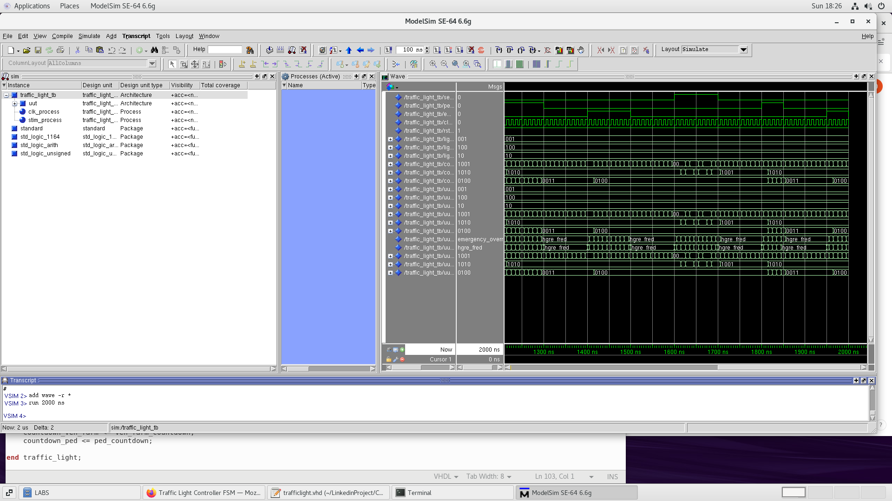

---

# Sensor-Driven Traffic Light Controller (VHDL)

- Designed and implemented a **sensor-driven traffic light controller** using **VHDL**, optimizing real-time traffic flow and reducing congestion.  
- **Adaptive timing:** Dynamically adjusts green light durations based on sensor-detected road usage.  
- **Priority-based control:** Allocates longer green phases to high-traffic roads for smoother traffic movement.  
- **Emergency vehicle override:** Enables immediate green signals for emergency vehicles, enhancing response times.  
- **Smart activation:** Minimizes delays at low-traffic junctions by switching lights **only when necessary**.  

---

##  **Project Documentation**  

### ** Elaborate Design**  
📌 **System architecture and design breakdown**  
  

### ** Traffic Light Schematic**  
📌 **Hardware-level representation of traffic signal connections**  
  
### **🔹 Finite State Diagram**  
📌 **State transition visualization for the traffic light controller**  
  

### **🔹 Simulation Waveforms (ModelSim)**  
📌 **Timing analysis of the traffic light controller, showing state transitions and signal changes over time**  
  
This version keeps everything clean while ensuring **all PDFs are properly linked**. 🚀
